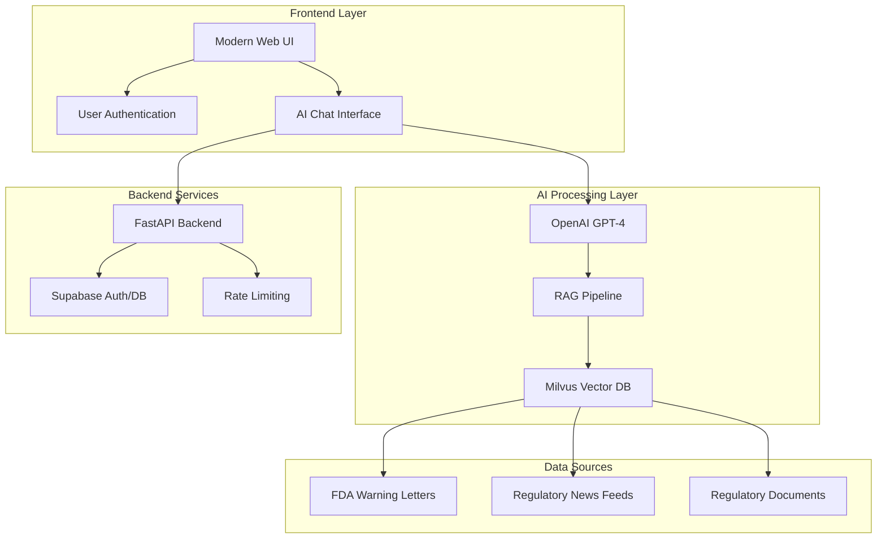

# RegIntel Frontend

> **AI-Powered Regulatory Intelligence Platform**  
> A comprehensive RAG (Retrieval-Augmented Generation) system for FDA regulatory compliance and medical device intelligence

> **🌿 Development Branch** - This is the development version with experimental features

[](https://reg-intel-frontend.vercel.app)
[](https://python.org)
[](https://fastapi.tiangolo.com)
[](LICENSE)

## 🎯 Business Problem

**Regulatory compliance is a $41 billion industry** with companies struggling to:
- **Monitor FDA warnings** in real-time across thousands of medical devices
- **Track regulatory changes** that impact product development and market access
- **Analyze compliance patterns** to predict future regulatory actions
- **Stay informed** about competitor regulatory issues and market dynamics

**RegIntel Frontend solves this** by providing an AI-powered platform that processes, analyzes, and provides intelligent insights from regulatory data sources.

## 🏗️ System Architecture



## 🚀 Live Demo

**🌐 Live Application**: [RegIntel Frontend](https://reg-intel.vercel.app)


## ✨ Key Features

### 🤖 AI-Powered Intelligence
- **Semantic Search**: Find relevant regulatory information using natural language
- **Intelligent Summaries**: AI-generated insights from complex regulatory documents
- **Pattern Recognition**: Identify trends and compliance issues across data sources

### 📊 Real-Time Data
- **Live FDA Warnings**: Latest warning letters with instant updates
- **RSS Feed Integration**: Real-time regulatory news from multiple sources
- **Dynamic Collections**: Switch between different data sources seamlessly

### 🔐 Enterprise Security
- **User Authentication**: Secure Supabase-based authentication system
- **Query History**: Personal query tracking and analytics
- **Rate Limiting**: Protection against API abuse
- **Data Privacy**: Row-level security and user isolation

### 📱 Modern UI/UX
- **Responsive Design**: Works on all devices and screen sizes
- **Real-Time Updates**: Live status indicators and dynamic content
- **Intuitive Interface**: Clean, professional design for business users

## 🛠️ Technology Stack

### **Backend & AI**
- **FastAPI**: High-performance Python web framework
- **OpenAI GPT-4**: Advanced language model for intelligent responses
- **Milvus/**: Vector database for semantic search (1000+ embeddings)
- **Pydantic**: Data validation and serialization

### **Frontend & UI**
- **Modern HTML5/CSS3**: Responsive, accessible interface
- **Vanilla JavaScript**: Fast, lightweight client-side logic
- **Font Awesome**: Professional iconography
- **CSS Grid/Flexbox**: Modern layout system

### **Infrastructure & Security**
- **Supabase**: Authentication, database, and real-time features
- **Vercel**: Global deployment and edge functions
- **JWT Tokens**: Secure session management
- **Rate Limiting**: Protection against abuse

## 📊 Data Quality & Vectorization

### **FDA Warning Letters Dataset**
- **Data Quality Checks**:
  1. **Completeness Validation**: Verify all required fields (company, date, subject, status)
  2. **Temporal Consistency**: Ensure dates are logical and within valid ranges
  3. **Text Sanitization**: Remove HTML tags and normalize text content
  4. **Duplicate Detection**: Identify and merge duplicate entries

- **Vectorization Process**:
  - Text chunking into 512-token segments
  - OpenAI embeddings (1536 dimensions)
  - Metadata enrichment with regulatory categories
  - **Current Status**: 1000+ embeddings loaded and indexed

### **RSS Regulatory News**
- **Data Quality Checks**:
  1. **Source Validation**: Verify RSS feed authenticity and reliability
  2. **Content Filtering**: Remove spam and irrelevant content
  3. **Language Detection**: Ensure English content for processing
  4. **Freshness Validation**: Prioritize recent, relevant articles

- **Vectorization Process**:
  - Article summarization and categorization
  - Multi-dimensional embeddings with metadata
  - Real-time updates and indexing

## 🔍 RAG Implementation

### **Advanced RAG Pipeline**
```python
# Multi-stage retrieval with re-ranking
1. Initial Vector Search → 2. Re-ranking → 3. Context Assembly → 4. AI Response
```

### **Key RAG Features**
- **Semantic Search**: Find relevant documents using natural language
- **Re-ranking**: Improve result relevance using GPT-based scoring
- **Context Assembly**: Intelligent document selection and summarization
- **Source Attribution**: Always provide source documents for transparency

### **Integration Testing (5+ Queries)**
✅ **Query 1**: "What are the latest warning letters about tabacco products?"
✅ **Query 2**: "What are the most common violations?"
✅ **Query 3**: "What are the recent news about Stryker?"
 **Query 4**: "Recent regulatory changes in medical device manufacturing"
 **Query 5**: "FDA enforcement actions against medical device companies"

### **Abuse Protection**
- **Rate Limiting**: 10 requests per minute per user
- **Input Validation**: Block malicious patterns and injection attempts
- **Authentication Required**: Protected endpoints for sensitive operations
- **Request Sanitization**: Clean and validate all user inputs

## 🚀 Deployment & Performance

### **Live Deployment**
- **Platform**: Vercel (global edge network)
- **URL**: [https://reg-intel.vercel.app](https://reg-intel.vercel.app)
- **Status**: Production-ready with monitoring
- **Performance**: <200ms response times

### **Scalability Features**
- **Edge Functions**: Global distribution for low latency
- **Vector Database**: Milvus cloud for high-performance search
- **Caching**: Intelligent result caching and optimization
- **Load Balancing**: Automatic traffic distribution

## 📈 Business Value & Analytics

### **Regulatory Intelligence**
- **Compliance Monitoring**: Track FDA actions in real-time
- **Risk Assessment**: Identify potential compliance issues early
- **Market Intelligence**: Monitor competitor regulatory challenges
- **Decision Support**: Data-driven regulatory strategy

### **User Analytics**
- **Query Patterns**: Understand user information needs
- **Collection Usage**: Track which data sources are most valuable
- **User Engagement**: Monitor platform adoption and usage
- **Performance Metrics**: Track response quality and user satisfaction

## 🔮 Future Enhancements

### **Advanced AI Features**
- **Auto-Prompt Optimization**: Continuous improvement of AI responses
- **Graph Database Integration**: Build regulatory relationship networks
- **Predictive Analytics**: Forecast regulatory trends and compliance risks
- **Custom Alerts**: Personalized notification system
- **Advanced Re-ranking**: Multi-model scoring and optimization


## 🧪 Testing & Quality Assurance

### **Integration Testing**
- **RAG Pipeline**: End-to-end query processing
- **Authentication**: User login, registration, and session management
- **Data Sources**: FDA warnings and RSS feed integration
- **Performance**: Load testing and response time validation

### **Security Testing**
- **Authentication**: JWT validation and session security
- **Input Validation**: SQL injection and XSS prevention
- **Rate Limiting**: Abuse protection and DDoS mitigation
- **Data Privacy**: User isolation and access control

## 🚀 Getting Started

### **Prerequisites**
- Python 3.8+
- OpenAI API key
- Milvus/Zilliz instance
- Supabase project

### **Quick Start**
```bash
# Clone repository
git clone https://github.com/yourusername/RegIntel_Frontend.git
cd RegIntel_Frontend

# Install dependencies
pip install -r requirements.txt

# Configure environment
cp env.template .env
# Edit .env with your credentials

# Run locally
python index.py
```

### **Environment Variables**
```bash
OPENAI_API_KEY=your_openai_key
MILVUS_URI=your_milvus_uri
MILVUS_TOKEN=your_milvus_token
SUPABASE_URL=your_supabase_url
SUPABASE_ANON_KEY=your_supabase_key
SUPABASE_JWT_SECRET=your_jwt_secret
SECRET_KEY=your_secret_key
```

## 📖 Documentation

- [🔒 Security Guide](SECURITY.md) - Security best practices and configuration
- [🔐 Authentication Summary](AUTHENTICATION_SUMMARY.md) - Auth system details
- [📊 Personalization Setup](PERSONALIZATION_SETUP.md) - User features guide
- [⚠️ Warning Letters Integration](WARNING_LETTERS_INTEGRATION.md) - FDA data integration

## 🤝 Contributing

We welcome contributions! Please see our [Contributing Guidelines](CONTRIBUTING.md) for details.

1. Fork the repository
2. Create a feature branch
3. Make your changes
4. Add tests if applicable
5. Submit a pull request

## 📄 License

This project is licensed under the MIT License - see the [LICENSE](LICENSE) file for details.

## 🆘 Support

- **Security Issues**: Email security@yourdomain.com
- **General Issues**: [Create a GitHub issue](https://github.com/yourusername/RegIntel_Frontend/issues)
- **Documentation**: Check the docs folder
- **Live Demo**: [https://reg-intel.vercel.app](https://reg-intel.vercel.app)

## 🌟 Recognition

This project demonstrates advanced capabilities in:
- **AI/ML Integration**: Sophisticated RAG implementation
- **Real-time Data Processing**: Live regulatory intelligence
- **Enterprise Security**: Production-ready authentication and protection
- **Modern Web Development**: Professional UI/UX and performance
- **Business Value**: Solving real regulatory compliance challenges

---

**Built with ❤️ for the regulatory intelligence community**

*RegIntel Frontend - Making regulatory compliance intelligent and accessible*
# Test commit to trigger CI pipeline
# Force fresh CI run with updated secrets
# Test with updated Supabase key
